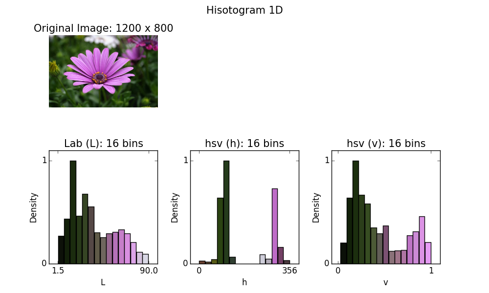
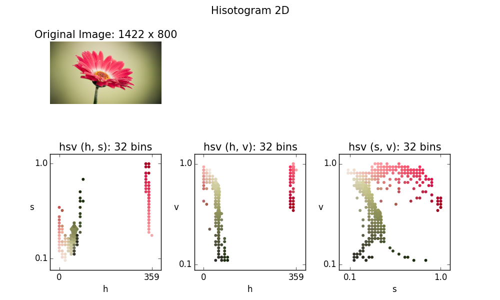

Color Histogram Demo (Python)
====

Simple python demos of Color Histogram.

This package includes:

* 1D color histogram: Hist1D class in [```color_histogram/core/hist_1d.py```](color_histogram/core/hist_1d.py).
* 2D color histogram: Hist2D class in [```color_histogram/core/hist_2d.py```](color_histogram/core/hist_2d.py).
* 3D color histogram: Hist3D class in [```color_histogram/core/hist_3d.py```](color_histogram/core/hist_3d.py).

## Result

### Histogram 1D:

Histogram 1D plotting in 1 channel from RGB, Lab, HSV color spaces.

#### Minimal example:

``` python
from color_histogram.io_util.image import loadRGB
from color_histogram.core.hist_1d import Hist1D

# Load image.
image = loadRGB(image_file)

# 16 bins, Lab color space, target channel L ('Lab'[0])
hist1D = Hist1D(image, num_bins=16, color_space='Lab', channel=0)

fig = plt.figure()
ax = fig.add_subplot(111)
hist1D.plot(ax)
plt.show()

```

In the following demo, I show the L (Lab), h (HSV), v (HSV) plots.



### Histogram 2D:

Histogram 2D plotting in 2 channels from RGB, Lab, HSV color spaces.

#### Minimal example:

``` python
from color_histogram.io_util.image import loadRGB
from color_histogram.core.hist_2d import Hist2D
import matplotlib.pyplot as plt

# Load image.
image = loadRGB(image_file)

# 32 bins, hsv color space, target channels (h, s) ('hsv'[0], 'hsv'[1])
hist2D = Hist2D(image, num_bins=32, color_space='hsv', channels=[0, 1])

fig = plt.figure()
ax = fig.add_subplot(111)
hist2D.plot(ax)
plt.show()
```

In the following demo, I show the (h, s), (h, v), (s, v) plots.



### Histogram 3D:

Histogram 3D plotting in RGB, Lab, HSV color spaces.

#### Minimal example:

``` python
from color_histogram.io_util.image import loadRGB
from color_histogram.core.hist_3d import Hist3D
import matplotlib.pyplot as plt
from mpl_toolkits.mplot3d import Axes3D

# Load image.
image = loadRGB(image_file)

# 16 bins, rgb color space
hist3D = Hist3D(image, num_bins=16, color_space='rgb')

fig = plt.figure()
ax = fig.add_subplot(111, projection='3d')
hist3D.plot(ax)
plt.show()

```


## Installation

*Note*: This program was only tested on **Windows** with **Python2.7**.
**Linux** and **Mac OS** are not officially supported,
but the following instructions might be helpful for installing on those environments.

### Dependencies
Please install the following required python modules.

* **NumPy**
* **SciPy**
* **matplotlib**
* **OpenCV**

As these modules are heavily dependent on NumPy modules, please install appropriate packages for your development environment (Python versions, 32-bit or 64-bit).
For 64-bit Windows, you can download the binaries from [**Unofficial Windows Binaries for Python Extension Packages**](http://www.lfd.uci.edu/~gohlke/pythonlibs/).

<!-- This program also uses **docopt** for CLI.
**docopt** will be installed automatically through the following **pip** command for main modules. -->

### Install main modules

You can use **pip** command for installing main modules.
Please run the following command from the shell.

``` bash
  > pip install git+https://github.com/tody411/ColorHistogram.git
```

## Usage
### Package Structure
* color_histogram: Main package.
    - main.py: Main module for testing.
    - results: Result images will be saved in the directory.

### Test Color Histogram Demo
You can test the color histogram demo with the following command from ```color_histogram``` directory..
``` bash
  > python main.py
```

This command will start downloading test images via Google Image API then run the ```color_histogram``` module to generate result images.

In the ```color_histogram/results``` folder, you can also find examples:

* ```hist_1d.py```
* ```hist_2d.py```
* ```hist_3d.py```

<!-- ## API Document

API document will be managed by [doxygen](http://www.stack.nl/~dimitri/doxygen/) framework.
Online version is provided in the following link:
* [**inversetoon API Document**](http://tody411.github.io/InverseToon/index.html) (html)

For a local copy, please use the following doxygen command from *doxygen* directory.
``` bash
  > doxygen doxygen_config
``` -->

<!-- ## Future tasks

* [ ] Performance tests. -->

## License

The MIT License 2015 (c) tody